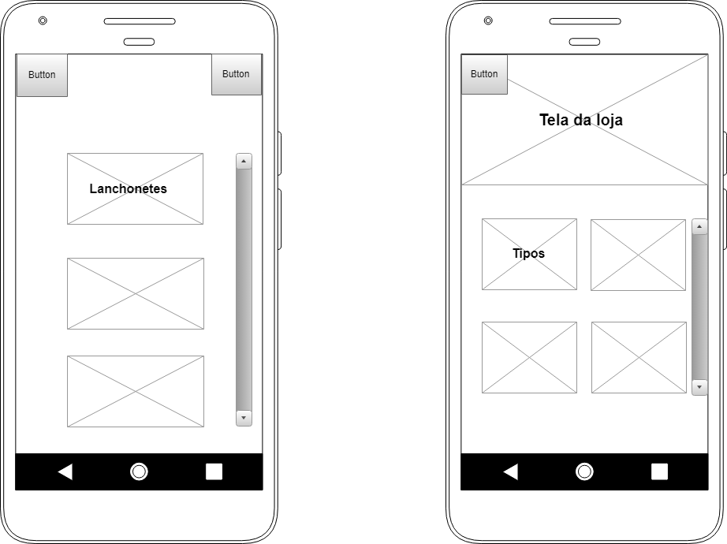
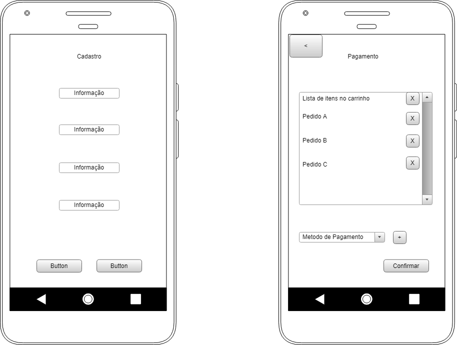
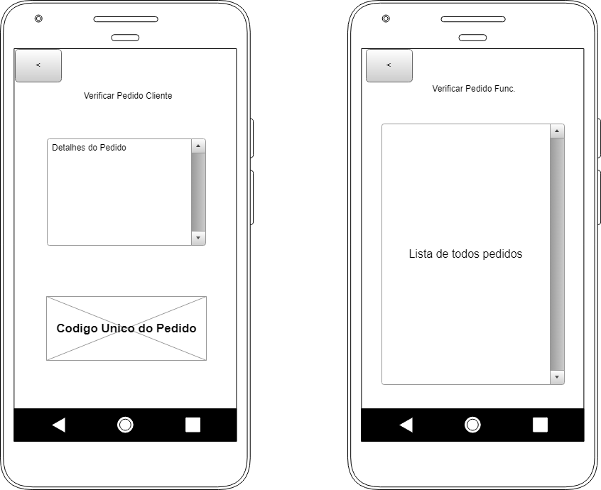

# Documento de Visão do Projeto MACKFOOD

Este documento apresenta uma solução de software para o projeto *MACKFOOD*, solicitado pelo cliente *Instituto Presbiteriano Mackenzie*, apresentando os problemas a serem solucionados, as necessidades dos principais envolvidos, o alcance do projeto e as funcionalidades 
esperadas do sistema.

## Objetivos

* Eliminar as filas das lanchonetes
* Agilizar o processo de vendas
* Aumentar Ganhos

> **Comentário do professor:** Na seção "Objetivos": seria melhor "Reduzir as filas" em lugar de "Eliminar as filas".

## Problema

* Descrição do problema: O aplicativo tem o objetivo de diminuir as filas nas lanchonetes e restaurantes dentro do campus Higienópolis da Universidade Presbiteriana Mackenzie, otimizando o atendimento aos clientes, reduzindo filas de espera.
* Quem é afetado pelo problema: Pontos de venda de produtos alimentícios dentro do campus Higienópolis da Universidade Presbiteriana Mackenzie e seus clientes.
* Impacto no negócio: Vendas, tempo de espera, filas, agilidade do atendimento.
* Benefícios de uma boa solução: Aumento da Renda com vendas de produtos alimentícios, redução do tempo de espera e das filas, melhora na qualidade do atendimento, fidelização de clientes.

## Definições, abreviações e outros termos do domínio do problema

* Menu / Cardápio
* Voucher
* Lanchonete / Restaurante

## Integração com outros sistemas

* Sistema da lanchonete
* Sistema de pagamento PagSeguro

> **Comentário do professor:** 	• Na seção "Integração com outros sitemas" (1): a integração com o sistema de cada lanchonete precisaria ser realizada caso-a-caso, uma vez que cada lanchonete pode ter um sistema diferente.

> **Comentário do professor:** Na seção "Integração com outros sistemas" (2): não haverá nenhuma integração com um sistema de e-mails (por exemplo, para confirmar o cadastro de um novo cliente)?

## Interessados

* Alunos do Mackenzie
* Funcionários do Mackenzie
* Estabelecimentos Alimentícios no Mackenzie

## Usuários

* Cliente
* Loja (Lanchonete/Restaurante)
* Administrador

## Funcionalidades do produto

* Realizar Cadastro
* Realizar Pedido
* Realizar Pagamento
* Cadastrar Menu

> **Comentário do professor:** Na seção "Funcionalidades do produto": haverá a função de busca/pesquisa de produto?

## Restrições do projeto

* Tipo de pagamento
* Serviços prestados

## Protótipos de tela

### Protótipos para funcionalidade Pedido

Fonte: Exemplos gerados pelo cacoo.com

### Protótipos para funcionalidade Cadastro e Pagamento

Fonte: Exemplos gerados pelo cacoo.com

### Protótipos para funcionalidade Verificar Pedido

Fonte: Exemplos gerados pelo cacoo.com
