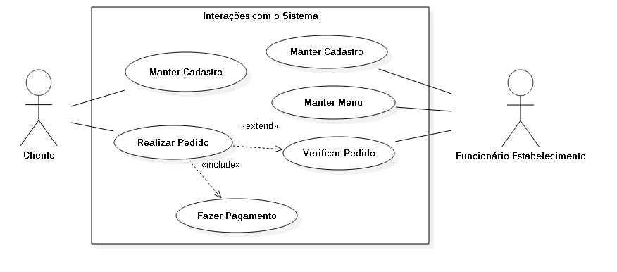

# Casos de uso

## 1. Diagrama de casos de uso

**Instruções do professor**: Insira abaixo o diagrama com os casos de uso do seu sistema. A imagem abaixo é somente um exemplo.

> **Comentário do professor:** Considerar a possibilidade de adicionar a funcionalidade de busca de um mesmo tipo de produto em diversos estabelecimentos.

> **Comentário do professor:** Avaliar se realmente existe esta relação de herança ("extends") entre os casos de uso.

## 2. Especificação dos casos de uso

**Instruções do professor**: Para cada caso de uso, criar as tabelas com a especificação do caso de uso. Siga o exemplo dado abaixo:

<<<<<<< HEAD
### 2.1. Caso de uso **Realiza Cadastro Cliente**
=======
### 2.1. Caso de uso **Manter Cadastro Cliente**
>>>>>>> 091ad9f1ee327d1b7fbd63aecdd5bd8ce7b07a8a

| Campo          | Informação        |
|---|---|
| Identificador: | UC-01              |
| Nome:          | Cadastra informações |
| Atores:        | Cliente |
| Sumário:       | Cadastra informações |

| Fluxo Principal |
|---|
| 1) Cliente Cadastra suas informações no sistema. |
| 2) Sistema cadastra cliente no banco de dados. |

| Fluxo Alternativo (UC-01a): O Cliente não cadastrou todas as informações. |
|---|
| 1) O sistema identifica o que está faltando informações e mostra uma mensagem de erro. |
| 2) Volta ao passo (1) do fluxo principal. |

| Fluxo Alternativo (UC-01b): O Cliente cadastrou informações não validas. |
|---|
| 1) O sistema percebe que alguma informação está errada e mostra uma mensagem de erro. |
| 2) Volta ao passo (1) do fluxo principal. |

<<<<<<< HEAD
### 2.2. Caso de uso **Realiza Cadastro Estabelecimento**
=======
### 2.2. Caso de uso **Manter Cadastro Estabelecimento**
>>>>>>> 091ad9f1ee327d1b7fbd63aecdd5bd8ce7b07a8a

|Campo | Informação | 
|---|---|
| Identificador :| UC-02                   |
| Nome :         | Cadastra Estabelecimento|
| Atores:        | Estabelecimento         |
| Sumario:       | Cadastra Informações    |

| Fluxo Principal |
| --- |
| 1) O Funcionário cadastra os dados do estabelecimento no sistema |
| 2) Sistema cadastra as informações fornecidas no banco de dados |

| Fluxo Alternativo (UC-02a): o Funcionário não cadastrou todas as informações |
|---|
| 1) O sistema identifica que há campos não cadastrados e não habilita o botão de envio|
<<<<<<< HEAD

| Fluxo Alternativo (UC-02b): O funcionário cadastrou informações não validas |
|---|
| 1) O sistema percebe que alguma informação está errada e mostra uma mensagem de erro. |
| 2) Volta ao passo (1) do fluxo principal. |

### 2.3. Caso de uso **Realizar Cadastro de Menu**

| Campo          | Informação        |
|---|---|
| Identificador: | UC-03          |
| Nome:          | Cadastra Menu |
| Atores:        | Estabelecimento |
| Sumário:       | Cadastra Informações de Menu |

| Fluxo Principal |
|---|
| 1) Funcionário escreve todo o menu em um campo do tipo Textbox. |
| 2) Funcionário clica em salvar. |
| 3) Sistema salva o conteúdo do campo no banco de dados. |

| Fluxo Alternativo (UC-03a): O funcionário não preencheu o campo |
|---|
| 1) O sistema identifica que o campo não foi preenchido e não habilita o botão de envio. |

| Fluxo Alternativo (UC-03b): O funcionário opta por carregar o campo com um arquivo .txt |
|---|
| 1) O funcionário clica no botão para upload de um arquivo em de texto (anything.txt). |
| 2) O sistema carrega todo o conteúdo do arquivo de texto no campo de menu. |
| 2) O sistema salva o arquivo no banco de dados. |

| Fluxo Alternativo (UC-03c): O funcionário opta por enviar o menu em PDF |
|---|
| 1) O funcionário clica no botão para upload de um arquivo em PDF. |
| 2) O sistema salva o arquivo no banco de dados. |

### 2.4. Caso de uso **Realizar Pedido**

| Campo          | Informação        |
|---|---|
| Identificador: | UC-04          |
| Nome:          | Pedido |
| Atores:        | Cliente |
| Sumário:       | Realizar Pedido |

| Fluxo Principal |
|---|
| 1) Cliente escolhe um estabelecimento. |
| 2) Cliente escolhe comida e quantidade. |
| 3) Cliente confirma o pedido. |
| 4) Sistema cadastra o pedido. |

> **Comentário do professor:** No caso de uso "Realiza pedido": não há a possibilidade de cada pedido ser formado por diferentes itens?

| Fluxo Alternativo (UC-04a): O cliente desiste da compra|
|---|
| 1) O cliente clica para cancelar. |
| 2) Volta ao passo (1) do fluxo principal.  |

| Fluxo Alternativo (UC-04b): O cliente não paga pelo pedido |
=======

| Fluxo Alternativo (UC-02b): O funcionário cadastrou informações não validas |
|---|
| 1) O sistema percebe que alguma informação está errada e mostra uma mensagem de erro. |
| 2) Volta ao passo (1) do fluxo principal. |

### 2.3. Caso de uso **Manter Cadastro Menu**

| Campo          | Informação        |
|---|---|
| Identificador: | UC-03          |
| Nome:          | Cadastra Menu |
| Atores:        | Estabelecimento |
| Sumário:       | Cadastra Informações de Menu |

| Fluxo Principal |
|---|
| 1) Funcionário escreve todo o menu em um campo do tipo Textbox. |
| 2) Funcionário clica em salvar. |
| 3) Sistema salva o conteúdo do campo no banco de dados. |

| Fluxo Alternativo (UC-03a): O funcionário não preencheu o campo |
|---|
| 1) O sistema identifica que o campo não foi preenchido e não habilita o botão de envio. |

| Fluxo Alternativo (UC-03b): O funcionário opta por carregar o campo com um arquivo .txt |
|---|
| 1) O funcionário clica no botão para upload de um arquivo em de texto (anything.txt). |
| 2) O sistema carrega todo o conteúdo do arquivo de texto no campo de menu. |
| 2) O sistema salva o arquivo no banco de dados. |

| Fluxo Alternativo (UC-03c): O funcionário opta por enviar o menu em PDF |
|---|
| 1) O funcionário clica no botão para upload de um arquivo em PDF. |
| 2) O sistema salva o arquivo no banco de dados. |

### 2.4. Caso de uso **Manter Pedido**

| Campo          | Informação        |
|---|---|
| Identificador: | UC-04          |
| Nome:          | Pedido |
| Atores:        | Cliente |
| Sumário:       | Realizar Pedido |

| Fluxo Principal |
|---|
| 1) Cliente escolhe um estabelecimento. |
| 2) Cliente escolhe itens a serem pedidos e quantidade. |
| 3) Cliente visualiza pedido. |
| 4) Cliente confirma o pedido. |
| 5) Sistema cadastra o pedido. |
| 6) Sistema cria caso de uso de pagamento. |

| Fluxo Alternativo (UC-04a): O cliente não paga pelo pedido |
>>>>>>> 091ad9f1ee327d1b7fbd63aecdd5bd8ce7b07a8a
|---|
| 1) O cliente no momento do pagamento, cancela a compra |
| 2) O sistema não confirma a compra.|
| 3) Volta ao passo (1) do fluxo principal.  |
<<<<<<< HEAD
=======
** é aqui? **

| Fluxo Alternativo (UC-04b): O cliente exclui itens da compra|
|---|
| 1) Cliente seleciona os itens a serem excluídos |
| 2) Cliente confirma a exclusão dos itens |
| 3) Volta ao passo (3) do fluxo principal |

| Fluxo Alternativo (UC-04b): O cliente escolhe mais itens para compra|
|---|
| 1) Cliente visualiza os pedidos |
| 2) Cliente confirma desejo de acrescentar mais itens ao pedido |
| 3) Volta ao passo (2) do fluxo principal |

>>>>>>> 091ad9f1ee327d1b7fbd63aecdd5bd8ce7b07a8a

**Instruções do professor**: As tabelas acima mostram um exemplo de especificação de **um único caso de uso**. Lembre-se de especificar cada um dos casos de uso.

### 2.5. Caso de uso **Fazer Pagamento**

| Campo          | Informação        |
|---|---|
| Identificador: | UC-06          |
| Nome:          | Pagamento |
| Atores:        | Cliente |
| Sumário:       | Fazer Pagamento |

| Fluxo Principal |
|---|
| 1) Cliente seleciona forma de pagamento. |
| 2) Sistema direciona cliente para api que controla o pagamento (PagSeguro). |

### 2.6. Caso de uso **Verificar Pedido**

| Campo          | Informação        |
|---|---|
| Identificador: | UC-05          |
| Nome:          | Pedido |
| Atores:        | Estabelecimento |
| Sumário:       | Verificar Pedido |

| Fluxo Principal |
|---|
| 1) Estabelecimento faz login no sistema. |
| 2) Estabelecimento visualiza pedidos em aberto. |
| 3) Estabelecimento seleciona pedido para verificar. |
| 4) Estabelecimento verifica pedido. |
| 5) Estabelecimento marca pedido como fechado. |

| Fluxo Alternativo (UC-05a): Não há pedidos em aberto |
|---|
| 1) Empresa faz login no sistema. |
| 2) Empresa recebe mensagem de que não há pedidos em aberto. |

