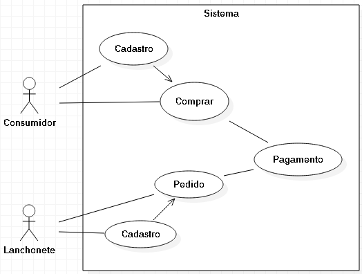

# Casos de uso

## 1. Diagrama de casos de uso

**Instruções do professor**: Insira abaixo o diagrama com os casos de uso do seu sistema. A imagem abaixo é somente um exemplo.

## 2. Especificação dos casos de uso

**Instruções do professor**: Para cada caso de uso, criar as tabelas com a especificação do caso de uso. Siga o exemplo dado abaixo:

### 2.1. Caso de uso **Realiza Cadastro Cliente**

| Campo          | Informação        |
|---|---|
| Identificador: | UC-01              |
| Nome:          | Cadastra informações |
| Atores:        | Cliente |
| Sumário:       | Cadastra informações |

| Fluxo Principal |
|---|
| 1) Cliente Cadastra suas informações no sistema. |
| 2) Sistema cadastra cliente no banco de dados. |

| Fluxo Alternativo (UC-01a): O Cliente não cadastrou todas as informações. |
|---|
| 1) O sistema identifica o que está faltando informações e mostra uma mensagem de erro. |
| 2) Volta ao passo (1) do fluxo principal. |

| Fluxo Alternativo (UC-01b): O Cliente cadastrou informações não validas. |
|---|
| 1) O sistema percebe que alguma informação está errada e mostra uma mensagem de erro. |
| 2) Volta ao passo (1) do fluxo principal. |

### 2.2. Caso de uso **Realiza Cadastro Estabelecimento**

|Campo | Informação | 
|---|---|
| Identificador :| UC-02                   |
| Nome :         | Cadastra Estabelecimento|
| Atores:        | Estabelecimento         |
| Sumario:       | Cadastra Informações    |

| Fluxo Principal |
| --- |
| 1) O Funcionário cadastra os dados do estabelecimento no sistema |
| 2) Sistema cadastra as informações fornecidas no banco de dados |

| Fluxo Alternativo (UC-02a): o Funcionário não cadastrou todas as informações |
|---|
| 1) O sistema identifica que há campos não cadastrados e não habilita o botão de envio|

| Fluxo Alternativo (UC-02b): O funcionário cadastrou informações não validas |
|---|
| 1) O sistema percebe que alguma informação está errada e mostra uma mensagem de erro. |
| 2) Volta ao passo (1) do fluxo principal. |

### 2.3. Caso de uso **Realiza Pedido**

| Campo          | Informação        |
|---|---|
| Identificador: | UC-03          |
| Nome:          | Pedido |
| Atores:        | Cliente |
| Sumário:       | Realizar Pedido |

| Fluxo Principal |
|---|
| 1) Cliente escolhe um estabelecimento. |
| 2) Cliente escolhe comida e quantidade. |
| 3) Cliente confirma o pedido. |
| 4) Sistema cadastra o pedido. |

**Instruções do professor**: As tabelas acima mostram um exemplo de especificação de **um único caso de uso**. Lembre-se de especificar cada um dos casos de uso.
