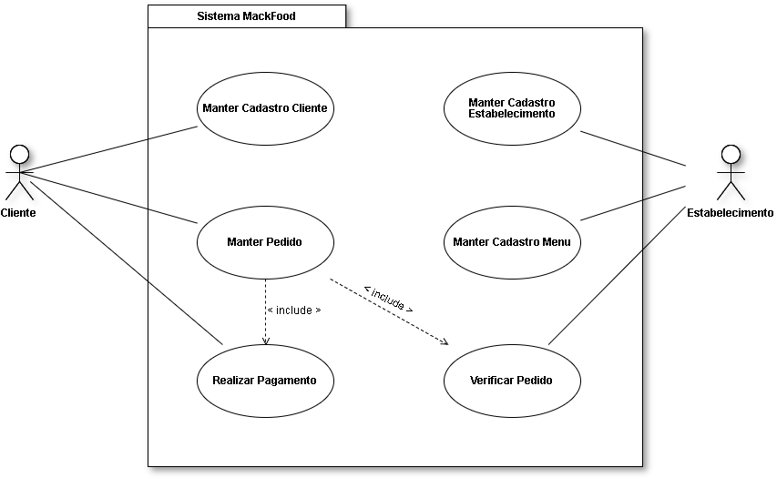

# Casos de uso

## 1. Diagrama de casos de uso

## 2. Especificação dos casos de uso

**Instruções do professor**: Para cada caso de uso, criar as tabelas com a especificação do caso de uso. Siga o exemplo dado abaixo:

### 2.1. Caso de uso **Manter Cadastro Cliente**

| Campo | Informação |
|---|---|
| Identificador: | UC-01   |
| Nome:          | Manter cadastro cliente |
| Atores:        | Cliente |
| Sumário:       | Cadastra informações do cliente |

| Fluxo Principal |
|---|
| 1) Cliente cadastra suas informações no sistema |
| 2) Sistema cadastra cliente no banco de dados |

| Fluxo Alternativo (UC-01a): Cliente não cadastrou todas as informações |
|---|
| 1) Sistema identifica que há campos não cadastrados e não habilita o botão de envio |

### 2.2. Caso de uso **Manter Cadastro Estabelecimento**

| Campo | Informação | 
|---|---|
| Identificador: | UC-02           |
| Nome :         | Manter cadastro estabelecimento |
| Atores:        | Estabelecimento |
| Sumário:       | Cadastra informações do estabelecimento |

| Fluxo Principal |
|---|
| 1) Funcionário cadastra os dados do estabelecimento no sistema |
| 2) Sistema cadastra as informações fornecidas no banco de dados |

| Fluxo Alternativo (UC-02a): Funcionário não cadastrou todas as informações |
|---|
| 1) Sistema identifica que há campos não cadastrados e não habilita o botão de envio |

### 2.3. Caso de uso **Manter Cadastro Menu**

| Campo | Informação |
|---|---|
| Identificador: | UC-03           |
| Nome:          | Manter Cadastro Menu |
| Atores:        | Estabelecimento |
| Sumário:       | Cadastra informações do Menu/Cardápio |

| Fluxo Principal |
|---|
| 1) Funcionário insere informações sobre o menu e clica em salvar |
| 2) Sistema salva o conteúdo no banco de dados |

| Fluxo Alternativo (UC-03a): Funcionário não preencheu o campo |
|---|
| 1) Sistema identifica que o campo não foi preenchido e não habilita o botão de envio |

| Fluxo Alternativo (UC-03b): Funcionário seleciona opção de carregar um arquivo .txt ou .pdf |
|---|
| 1) Funcionário clica no botão de upload e seleciona o arquivo e confirma |
| 2) Sistema carrega todo o conteúdo do arquivo e salva no banco de dados |

### 2.4. Caso de uso **Manter Pedido**

| Campo | Informação |
|---|---|
| Identificador: | UC-04   |
| Nome:          | Realizar pedido |
| Atores:        | Cliente |
| Sumário:       | Cliente adiciona ou remove produtos no carrinho |

| Fluxo Principal |
|---|
| 1) Cliente escolhe um estabelecimento |
| 2) Sistema mostra opções de comida do estabelecimento |
| 3) Cliente escolhe comida e quantidade e confirma |
| 4) Sistema cadastra o pedido no carrinho e direciona para carrinho |

| Fluxo Alternativo (UC-04a): Cliente exclui comida do carrinho |
|---|
| 1) Cliente seleciona a opção de excluir comida do carrinho |
| 2) Sistema pede confirmação |
| 3) Cliente confirma |
| 4) Sistema salva alteração e volta para o carrinho |

| Fluxo Alternativo (UC-04b): Cliente altera quantidade de determinada comida |
|---|
| 1) Cliente seleciona aumentar ou diminuir quantidade |
| 2) Sistema salva alteração |

| Fluxo Alternativo (UC-04c): Cliente decide continuar comprando |
|---|
| 1) Cliente seleciona a opção adicionar mais itens |
| 2) Sistema volta para o fluxo principal (UC-04) |

| Fluxo Alternativo (UC-04d): Cliente finaliza pedido |
|---|
| 1) Cliente seleciona a opção finalizar pedido |
| 2) Sistema direciona para caso de uso 2.5. Realizar Pagamento |

### 2.5. Caso de uso **Realizar Pagamento**

| Campo | Informação |
|---|---|
| Identificador: | UC-06   |
| Nome:          | Realizar pagamento |
| Atores:        | Cliente |
| Sumário:       | Fazer pagamento |

| Fluxo Principal |
|---|
| 1) Cliente seleciona forma de pagamento. |
| 2) Sistema direciona cliente para API que controla o pagamento (PagSeguro). |

### 2.6. Caso de uso **Verificar Pedido**

| Campo | Informação |
|---|---|
| Identificador: | UC-05           |
| Nome:          | Verificar Pedido |
| Atores:        | Estabelecimento |
| Sumário:       | Verificar Pedido |

| Fluxo Principal |
|---|
| 1) Estabelecimento seleciona vizualizar pedidos em aberto |
| 2) Sistema mostra todos pedidos em aberto |

| Fluxo Alternativo (UC-05a): Funcionario finaliza pedido |
|---|
| 1) Estabelecimento seleciona finalizar pedido |
| 2) Sistema fecha pedido, manda mensagem para cliente e atualiza o sistema |
