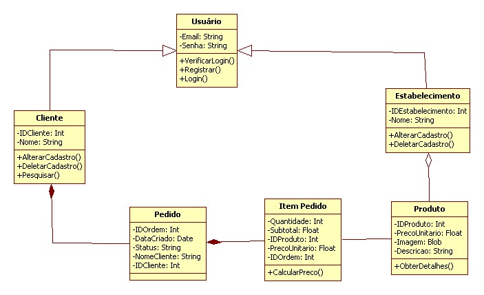

# Detalhamento dos componentes

Diagrama de Classes

Para cada componente da solução, elaborar um diagrama de classes.

Veja alguns [exemplos de diagramas de classes](http://www.itmeyer.at/umlet/uml2/travelDetailDiagram.html).
